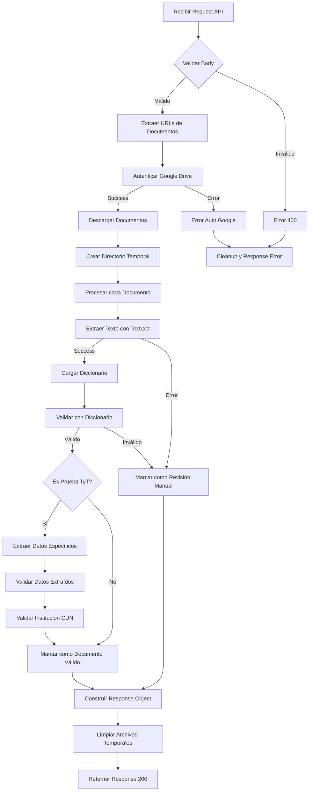
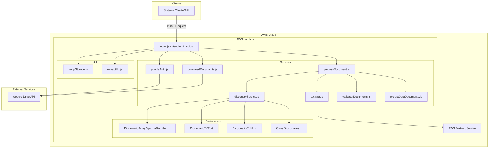
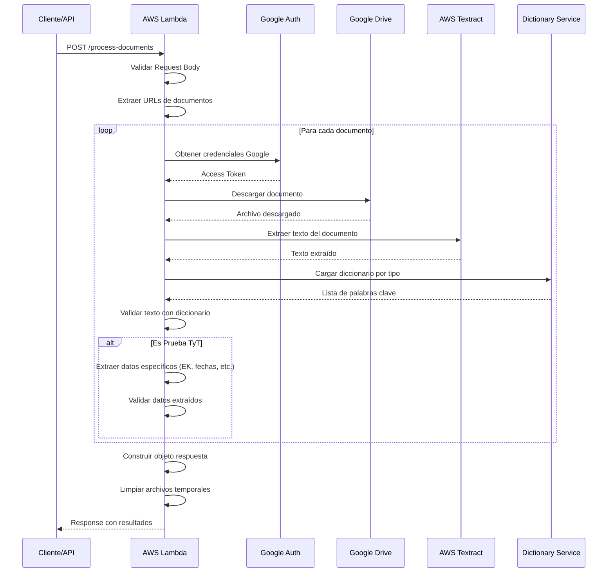
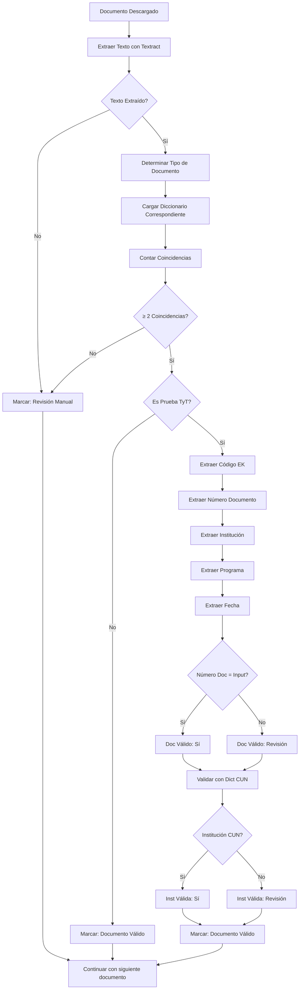
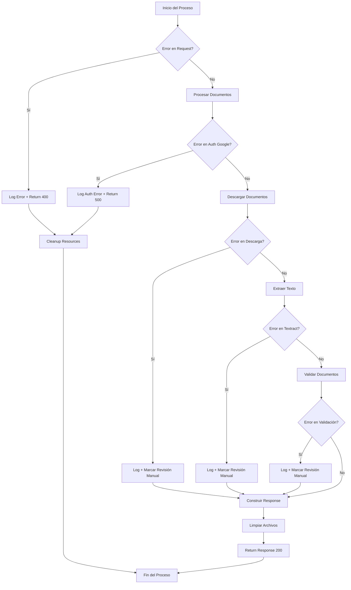

## **Sistema de Procesamiento de Documentos Académicos para Grados**

---

## 0. Desarrolladores

| Nombre | Rol |
|----|----|
| Camilo Andres Vides Torres | Desarrollador Fullstack IA Automatizaciones |
---

## 1. Introducción

Esta documentación técnica presenta de manera integral el Sistema de Procesamiento de Documentos Académicos, una solución innovadora que automatiza la validación de documentos educativos. El documento está estructurado siguiendo las mejores prácticas de documentación de software, abarcando desde la conceptualización hasta la implementación práctica del sistema.

### 1.1 Propósito
Este documento describe la arquitectura, implementación, despliegue y mantenimiento del Sistema de Procesamiento de Documentos Académicos para grados, facilitando la validación automática de documentos para procesos de graduación en instituciones educativas.

### 1.2 Alcance
El sistema permite la descarga automática de documentos desde Google Drive, extracción de texto mediante AWS Textract, y validación mediante diccionarios especializados.

---

## 2. Descripción General

### 2.1 Objetivos del Proyecto

* **Automatización:** Reducir procesos manuales en la validación de documentos académicos.
* **Precisión:** Mejorar la exactitud en la extracción y validación de información.
* **Escalabilidad:** Procesar múltiples documentos de forma concurrente y eficiente.
* **Trazabilidad:** Registrar todos los procesos de validación para auditoría.

### 2.2 Beneficios:

- [x] Reducción de tiempo de procesamiento
- [x] Disminución de errores humanos
- [x] Automatización de validaciones
- [x] Integración con sistemas existentes

### 2.3 Público Objetivo

* Administradores académicos
* Personal de registro y control
* Auditores y supervisores

### 2.4 Funcionalidades Principales:

- [x] Descarga automática desde Google Drive
- [x] Extracción de texto con AWS Textract
- [x] Validación con diccionarios especializados
- [x] Extracción de datos específicos

---

## 3. Arquitectura del Sistema

El sistema está basado en una arquitectura serverless en AWS:

| Componente | Descripción | Tecnología |
|----|----|----|
| **AWS Lambda** | Función principal de procesamiento | Node.js 22.x |
| **AWS Textract** | Extracción de texto de documentos | AWS AI Service |
| **Google Drive API** | Descarga de documentos | Google APIs |
| **Diccionarios** | Validación de contenido | Archivos de texto |

### Diagrama de Flujo



### Diagrama Arquitectura de componentes



### Diagrama de secuencia detallado


### Diagrama de flujo de Validacion de Documentos


### Diagrama de Manejo de errores


---

## 4. Requisitos del Sistema

### 4.1 Requisitos Funcionales

| ID | Requisito | Descripción |
|----|----|----|
| RF1 | Descarga de Documentos | Descargar archivos desde Google Drive usando URLs |
| RF2 | Extracción de Texto | Extraer texto de documentos PDF e imágenes |
| RF3 | Validación de Contenido | Validar documentos usando diccionarios especializados |
| RF4 | Extracción de Datos | Extraer información específica de pruebas TyT |
| RF5 | Response Processing | Construir respuesta estructurada con resultados |

### 4.2 Requisitos No Funcionales

| ID | Requisito | Descripción | Valor |
|----|----|----|-----|
| RNF1 | Tiempo de Procesamiento | Procesar documentos completos | ~30 segundos promedio |
| RNF2 | Concurrencia | Manejar solicitudes concurrentes | Máximo 60 peticiones/segundo |
| RNF3 | Disponibilidad | Uptime del servicio | 99.9% |
| RNF4 | Seguridad | Manejo seguro de credenciales y datos | Cifrado en tránsito |
| RNF5 | Escalabilidad | Procesamiento paralelo de documentos | Automático con Lambda |

### 4.3 ⚠️ Limitaciones de Concurrencia

| Aspecto | Limitación | Recomendación |
|---------|------------|---------------|
| **Rate Limit** | Máximo 60 peticiones por segundo | Implementar throttling en el cliente |
| **Tiempo de Procesamiento** | ~30 segundos por solicitud | Considerar timeouts en llamadas |
| **Google Drive API** | 1000 requests/100 segundos/usuario | Monitorear uso de cuotas |
| **AWS Textract** | 5 TPS por región | Distribuir carga geográficamente |

---

## 5. Diseño del Sistema

### 5.1 Casos de Uso Principales

| Actor | Caso de Uso | Descripción |
|----|----|----|
| Sistema Externo | Enviar Documentos | Envía datos con URLs de Google Drive |
| Lambda Function | Procesar Documentos | Descarga, extrae y valida documentos |
| AWS Textract | Extraer Texto | Convierte documentos a texto plano |
| Response Handler | Construir Respuesta | Estructura resultados de validación |

### 5.2 Modelo de Datos

#### Entidades Principales:

| Entidad | Atributos Principales | Descripción |
|----|----|----|
| Document Request | ID, NombreCompleto, URLs documentos | Solicitud de procesamiento |
| Validation Result | Estado, datos extraídos, errores | Resultado de validación |
| Dictionaries | Palabras clave por tipo | Archivos de validación |
| Archivos Temporales | Rutas, metadata | Gestión de archivos descargados |

---

## 6. Implementación

### 6.1 Herramientas y Tecnologías

* **Runtime:** Node.js 22.x
* **AWS Services:** Lambda, Textract
* **APIs Externas:** Google Drive API v3
* **Librerías:** googleapis, aws-sdk, fs-extra

### 6.2 Estructura del Código

```
document-processor-lambda/
├── src/
│   ├── index.js                     # Handler principal
│   ├── services/
│   │   ├── dictionaryService.js     # Gestión de diccionarios
│   │   ├── downloadDocuments.js    # Descarga desde Google Drive
│   │   ├── extractDataDocuments.js # Extracción de datos específicos
│   │   ├── extractUrl.js           # Extracción de URLs
│   │   ├── googleAuth.js           # Autenticación Google
│   │   ├── processDocument.js      # Procesamiento principal
│   │   ├── textract.js             # Integración AWS Textract
│   │   └── validatorDocuments.js   # Validación con diccionarios
│   └── utils/
│       └── tempStorage.js          # Gestión de archivos temporales
├── dictionaries/                   # Diccionarios de validación
├── build-lambda.js                 # Script de construcción
├── package.json
└── README.md
```

### 6.3 Tipos de Documentos Soportados

| Tipo | Descripción | Diccionario |
|------|-------------|-------------|
| cedula | Cédula de ciudadanía | Diccionario_Documentos_Identidad.txt |
| diploma_bachiller | Diploma de bachiller | DiccionarioActayDiplomaBachiller.txt |
| diploma_tecnico | Diploma técnico | DiccionarioActayDiplomaTecnico.txt |
| diploma_tecnologo | Diploma tecnólogo | DiccionarioActayDiplomaTecnologo.txt |
| titulo_profesional | Título profesional | DiccionarioActayDiplomaPregrado.txt |
| prueba_tt | Prueba Saber TyT | DiccionarioTYT.txt |
| icfes | Resultados ICFES | DiccionarioIcfes.txt |
| recibo_pago | Recibo de pago | DiccionarioPagoDerechosDeGrado.txt |

---

## 7. Despliegue

### 7.1 Requisitos del Entorno

| Componente | Versión/Requerimiento | Descripción |
|----|----|----|
| AWS Lambda | Runtime Node.js 22.x | Entorno de ejecución |
| Memoria | 512 MB mínimo | Recursos de Lambda |
| Timeout | 5 minutos (300 segundos) | Tiempo máximo de ejecución |
| AWS Textract | Región us-east-1 | Servicio de extracción de texto |

### 7.2 Variables de Entorno Requeridas

```bash
# Google Drive API
GOOGLE_CLIENT_ID=tu_client_id
GOOGLE_CLIENT_SECRET=tu_client_secret
GOOGLE_REFRESH_TOKEN=tu_refresh_token
```

### 7.3 Procedimiento de Despliegue

1. Preparación del Código:

```bash
# Construir el paquete de despliegue
npm run build
```

2. Configuración de AWS Lambda:
```bash
# Crear función Lambda
aws lambda create-function \
  --function-name document-processor \
  --runtime nodejs18.x \
  --role arn:aws:iam::account:role/lambda-execution-role \
  --handler src/index.handler \
  --zip-file fileb://lambda-deployment-prod.zip
```

3. Configurar Variables de Entorno:
```bash
# Configurar variables
aws lambda update-function-configuration \
  --function-name document-processor \
  --environment Variables='{
    "GOOGLE_CLIENT_ID":"tu_client_id",
    "GOOGLE_CLIENT_SECRET":"tu_client_secret"
  }'
```

4. Configurar Permisos IAM:
```json
{
  "Version": "2012-10-17",
  "Statement": [
    {
      "Effect": "Allow",
      "Action": [
        "textract:DetectDocumentText",
        "textract:AnalyzeDocument"
      ],
      "Resource": "*"
    }
  ]
}
```

## 8. Consideraciones de Rendimiento

### 8.1 ⚠️ Limitaciones Críticas

| Aspecto | Limitación | Impacto |
|---------|------------|---------|
| **Concurrencia Máxima** | 60 requests/segundo | Errores 429 si se excede |
| **Tiempo de Procesamiento** | 30 segundos promedio | Planificar timeouts acordes |
| **Google Drive Quota** | 1000 requests/100s | Posibles fallos de descarga |
| **Textract Limits** | 5 TPS por región | Cuellos de botella en OCR |

### 8.2 Recomendaciones de Uso

1. **Control de Concurrencia:**
   - Implementar rate limiting en el cliente
   - Usar colas para gestionar picos de carga
   - Monitorear métricas de Lambda

2. **Gestión de Timeouts:**
   - Cliente: timeout mínimo 35 segundos
   - API Gateway: configurar timeout 30 segundos
   - Retry logic para fallos temporales

3. **Optimización de Performance:**
   - Procesar documentos más pequeños primero
   - Implementar caché para diccionarios
   - Monitorear memoria y CPU usage

## 9. Pruebas

### 9.1 Estrategia de Pruebas

- Pruebas Unitarias: Validación de cada servicio individual
- Pruebas de Integración: Verificar comunicación entre servicios
- Pruebas de Carga: Evaluar rendimiento bajo múltiples solicitudes
- Pruebas de Validación: Verificar precisión de extracción de datos

### 9.2 Plan de Pruebas

| Tipo de Prueba | Objetivo | Herramienta |
|----|----|----|
| Funcionales | Verificar procesamiento correcto | Postman, curl |
| Rendimiento | Evaluar tiempos de respuesta | AWS CloudWatch |
| Concurrencia | Probar limits de 60 req/sec | Artillery, JMeter |
| Validación | Comprobar precisión de extracción | Casos de prueba manuales |

### 9.3 Casos de Prueba Críticos

| Caso | Descripción | Resultado Esperado |
|----|----|----|
| TC001 | Procesar cédula válida | "Documento Valido" |
| TC002 | Procesar prueba TyT | Extraer código EK correctamente |
| TC003 | Documento inválido | "Revision Manual" |
| TC004 | URL de Google Drive incorrecta | Error controlado |
| TC005 | Test de concurrencia (60 req/sec) | Sin errores 429 |

## 10. Mantenimiento

### 10.1 Estrategia de Mantenimiento

- Mantenimiento Correctivo: Corrección de errores en validaciones
- Mantenimiento Preventivo: Actualización de diccionarios y credenciales
- Mantenimiento Evolutivo: Nuevos tipos de documentos y validaciones

### 10.2 Monitoreo y Logs

**CloudWatch Logs**
Los logs están organizados por prefijos:

- [MAIN] - Flujo principal de ejecución
- [DOWNLOAD] - Descarga de archivos desde Google Drive
- [TEXTRACT] - Extracción de texto con AWS Textract
- [PROCESS] - Procesamiento de documentos
- [DICT] - Validación con diccionarios

**Métricas Importantes**
| Métrica | Descripción | Umbral |
|----|----|----|
| Duración | Tiempo de ejecución | < 40 segundos |
| Errores | Fallos en procesamiento | < 5% |
| Memoria | Uso de memoria | < 400 MB |
| Invocaciones | Número de ejecuciones | Monitoreo continuo |
| Concurrencia | Requests simultáneos | < 60/segundo |

### 10.3 Registro de Cambios (Changelog)

| Versión | Fecha | Descripción | Responsable |
|----|----|----|----|
| 1.0.0 | 01/06/2025 | Versión inicial de lanzamiento | Camilo Vides |

## 11. API Reference

### 11.1 Endpoint Principal
```
POST /process-documents
Content-Type: application/json
```

### 11.2 Request Body
```json
{
  "ID": 2521,
  "Hora_agregado": "08-Apr-2025 17:28:08",
  "Direccion_IP": "186.86.49.45",
  "Nombre_completo": "CESAR EDUARDO, MARTINEZ BOLAÑOS",
  "Tipo_de_documento": "CC Cédula de ciudadanía",
  "Numero_de_Documento": "1061735630",
  "Confirma_tu_numero_de_documento": null,
  "Correo_electronico_institucional": "cesar.martinezb@cun.edu.co",
  "Correo_electronico_personal": "cesareduardo666@gmail.com",
  "Numero_de_Telefono_celular": "3187394414",
  "Numero_de_Telefono_fijo_no_es_un_campo_obligatorio": null,
  "Puntaje_pruebas_saber_11": null,
  "Registro_AC_Numero_de_identificacion_de_las_pruebas_saber_11": "AC200811201995",
  "Registro_EK_Numero_de_identificacion_de_las_pruebas_T_T_y_saber_PRO": null,
  "Vas_a_asistir_a_ceremonia_de_grado": "No - Quiero por secretaría",
  "Sede_de_la_ceremonia": null,
  "Regionales_sin_sede_fisica": null,
  "Nivel_de_formacion_del_cual_esta_solicitando_grado": "Técnico Profesional",
  "Programa_del_cual_esta_solicitando_grado_Especializaciones": null,
  "Programa_del_cual_esta_solicitando_grado": "INGENIERÍA DE SISTEMAS",
  "Modalidad": "Virtual",
  "En_que_sede_deseas_recoger_tu_diploma": "Pasto",
  "Eres_estudiante_convalidacion_de_titulo": "No",
  "Copia_de_cedula": "https://drive.google.com/file/d/1PYe50T3dEzAtr9sl3Sv6piBea3Lbskzm/view?usp=drivesdk",
  "Diploma_y_acta_de_bachiller": "https://drive.google.com/file/d/1gAyuEgEeYyhsqMcU67jYxzrdrX95EYbP/view?usp=drivesdk",
  "Icfes": "https://drive.google.com/file/d/1LI10zdiBf-o6GA8sRKO5dYgDVHJMuj0Z/view?usp=drivesdk",
  "diploma_tecnico": null,
  "diploma_tecnologo": null,
  "Titulo_profesional": null,
  "Prueba_T_T": "https://drive.google.com/file/d/1FhfY1zG8oyX1W0uwF2KabX7cHV5T3EV6/view?usp=drivesdk",
  "Soporte_de_encuesta_momento_0": "https://drive.google.com/file/d/1fEGydDaXWUC_u-Lb3gnj6qfqODtq3Rpv/view?usp=drivesdk",
  "Acta_de_homologacion": null,
  "Recibo_de_pago_derechos_de_grado": null,
  "Autorizacion_tratamiento_de_datos": "Agreed"
}
```

### 11.3 Response Body
```json
{
  "ID": 2521,
  "NombreCompleto": "CESAR EDUARDO, MARTINEZ BOLAÑOS",
  "TipoDocumento": "CC Cédula de ciudadanía",
  "NumeroDocumento": "1061735630",
  "Modalidad": "Virtual",
  "NivelDeFormacionSolicitadoParaGrado": "Técnico Profesional",
  "ProgramaDelCualSolicita": "INGENIERÍA DE SISTEMAS",
  "CorreoInsitucional": "cesar.martinezb@cun.edu.co",
  "CorreoPersonal": "cesareduardo666@gmail.com",
  "FotocopiaDocumento": "Documento Valido",
  "DiplomayActaGradoBachiller": "Revisión Manual",
  "DiplomayActaGradoTecnico": "Documento no adjunto",
  "DiplomayActaGradoTecnologo": "Documento no adjunto",
  "DiplomayActaGradoPregrado": "Documento no adjunto",
  "ResultadoSaberProDelNivelParaGrado": "Documento Valido",
  "ExamenIcfes_11": "Documento Valido",
  "RecibiDePagoDerechosDeGrado": "Documento no adjunto",
  "EK": "Extraccion Manual",
  "Autorización_tratamiento_de_datos": "Agreed",
  "Num_Documento_Extraido": "Extraccion Manual",
  "Institucion_Extraida": "Extraccion Manual",
  "Programa_Extraido": "Extraccion Manual",
  "Fecha_Presentacion_Extraida": "Extraccion Manual",
  "Institucion_Valida": "N/A",
  "Num_Doc_Valido": "N/A",
  "Encuesta_M0": "Documento Valido",
  "Acta_Homologacion": "Documento no adjunto"
}
```

## 12. Solución de Problemas

### 12.1 Errores Comunes

| Error | Causa | Solución |
|----|----|----|
| PERMISSION_DENIED | Sin permisos en Google Drive | Verificar compartido del archivo |
| NO_TEXT_EXTRACTED | Textract no extrajo texto | Verificar calidad del documento |
| AUTH_DOWNLOAD_ERROR | Credenciales Google inválidas | Regenerar refresh token |
| RATE_LIMIT_EXCEEDED | Excedido límite de 60 req/sec | Implementar throttling |
| TIMEOUT_ERROR | Procesamiento > 30 segundos | Revisar tamaño de documentos |

### 12.2 Validación de Documentos

**Estados de Validación**
| Estado | Descripción |
|----|----|
| "Documento Valido" | Pasó todas las validaciones |
| "Revision Manual" | Requiere verificación humana |
| "N/A" | No aplica para este nivel |
| "Documento no adjunto" | No se proporcionó URL |

### 12.3 ⚠️ Manejo de Concurrencia

**Recomendaciones para evitar problemas:**
1. No enviar más de 60 requests por segundo
2. Implementar retry logic con backoff exponencial
3. Monitorear CloudWatch para errores de throttling
4. Usar colas para gestionar picos de demanda

## 13. Seguridad

### 13.1 Manejo de Credenciales

- Variables de entorno para credenciales sensibles
- Rotación periódica de tokens de Google
- Cifrado en tránsito y en reposo
- Principio de menor privilegio en IAM

### 13.2 Validación de Entrada

- Sanitización de URLs de Google Drive
- Validación de tipos de archivo
- Límites de tamaño de documento (10MB)
- Control de timeout en operaciones

## 14. Conclusiones

Esta documentación proporciona una visión completa del sistema de procesamiento de documentos académicos. El sistema automatiza eficientemente la validación de documentos educativos, reduciendo significativamente el tiempo de procesamiento y mejorando la precisión de las validaciones.

**Recomendaciones:**

- Mantener actualizados los diccionarios de validación
- Monitorear regularmente las métricas de CloudWatch
- Respetar los límites de concurrencia (60 req/sec)
- Realizar pruebas periódicas con diferentes tipos de documentos
- Documentar cualquier nuevo tipo de documento que se agregue

**⚠️ Notas Importantes de Operación:**

- **Tiempo de procesamiento:** ~30 segundos por solicitud
- **Límite de concurrencia:** Máximo 60 peticiones por segundo
- **Timeout recomendado:** 35 segundos en el cliente
- **Monitoreo continuo:** Esencial para detectar degradación del servicio

**Notas Adicionales:**

- URL de Producción: [Lambda Function URL](https://64npbyhrg3eodw5zh7ofxtu5yq0udymm.lambda-url.us-east-1.on.aws/)
- Contacto de Soporte: Fabrica de software
- Repositorio: Disponible en control de versiones interno

---

**Versión**: 1.0.0  
**Última actualización**: Junio 2025

---