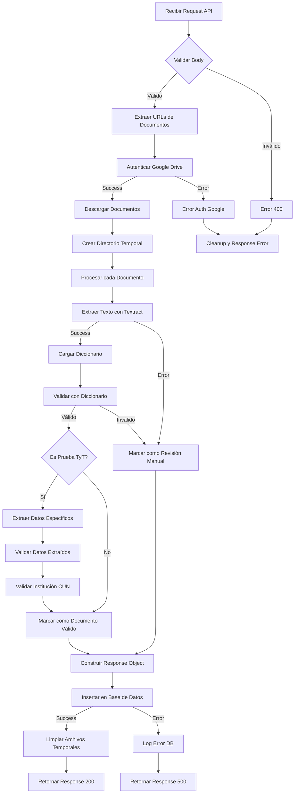
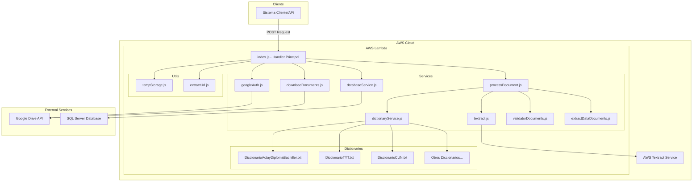
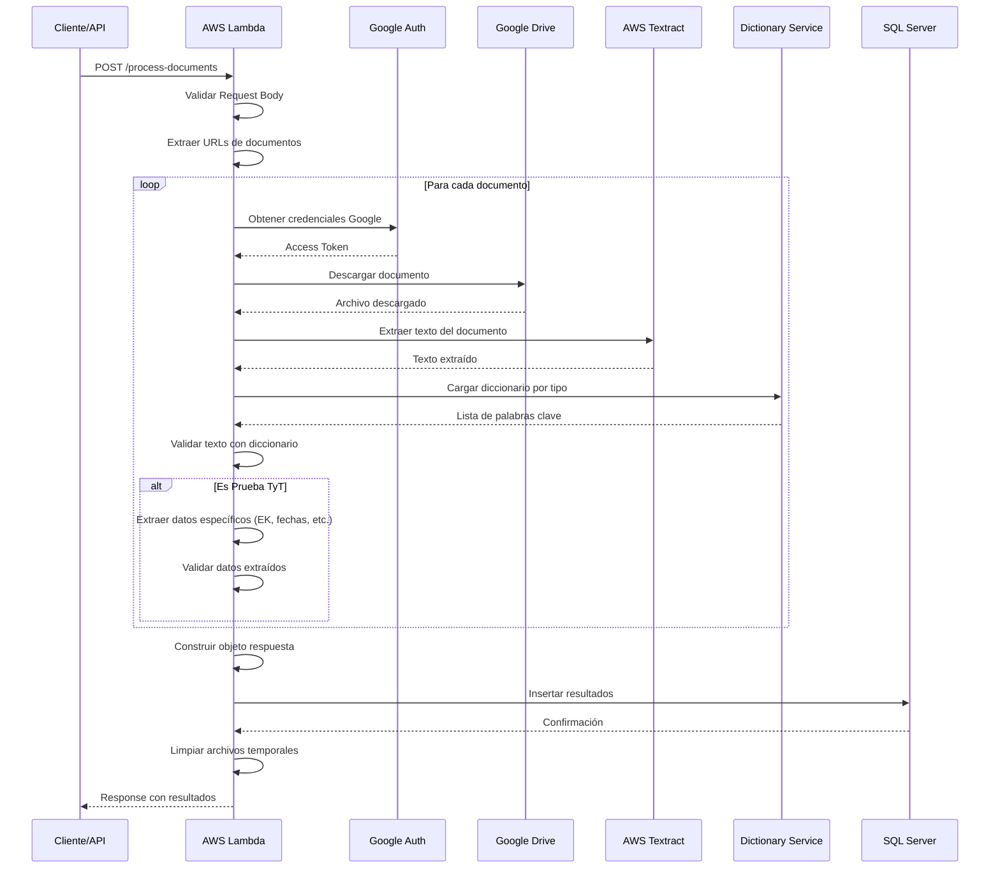
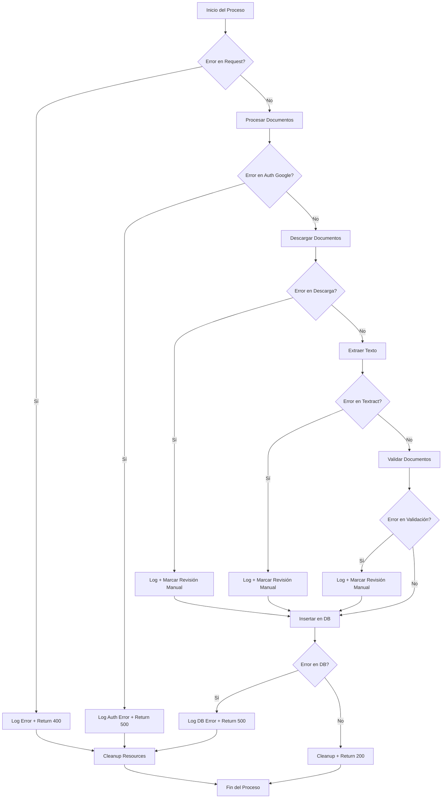

## **Sistema de Procesamiento de Documentos Académicos para Grados**

---

## 0. Desarrolladores

| Nombre | Rol |
|----|----|
| Camilo Andres Vides Torres | Desarrollador Fullstack IA Automatizaciones |
---

## 1. Introducción

Esta documentación técnica presenta de manera integral el Sistema de Procesamiento de Documentos Académicos, una solución innovadora que automatiza la validación de documentos educativos. El documento está estructurado siguiendo las mejores prácticas de documentación de software, abarcando desde la conceptualización hasta la implementación práctica del sistema.

### 1.1 Propósito
Este documento describe la arquitectura, implementación, despliegue y mantenimiento del Sistema de Procesamiento de Documentos Académicos para grados, facilitando la validación automática de documentos para procesos de graduación en instituciones educativas.

### 1.2 Alcance
El sistema permite la descarga automática de documentos desde Google Drive, extracción de texto mediante AWS Textract, validación mediante diccionarios especializados y almacenamiento de resultados en SQL Server.

---

## 2. Descripción General

### 2.1 Objetivos del Proyecto

* **Automatización:** Reducir procesos manuales en la validación de documentos académicos.
* **Precisión:** Mejorar la exactitud en la extracción y validación de información.
* **Escalabilidad:** Procesar múltiples documentos de forma concurrente y eficiente.
* **Trazabilidad:** Registrar todos los procesos de validación para auditoría.

### 2.2 Beneficios:

- [x] Reducción de tiempo de procesamiento
- [x] Disminución de errores humanos
- [x] Automatización de validaciones
- [x] Integración con sistemas existentes

### 2.3 Público Objetivo

* Administradores académicos
* Personal de registro y control
* Auditores y supervisores

### 2.4 Funcionalidades Principales:

- [x] Descarga automática desde Google Drive
- [x] Extracción de texto con AWS Textract
- [x] Validación con diccionarios especializados
- [x] Almacenamiento en base de datos
- [x] Extracción de datos específicos

---

## 3. Arquitectura del Sistema

El sistema está basado en una arquitectura serverless en AWS:

| Componente | Descripción | Tecnología |
|----|----|----|
| **AWS Lambda** | Función principal de procesamiento | Node.js 22.x |
| **AWS Textract** | Extracción de texto de documentos | AWS AI Service |
| **Google Drive API** | Descarga de documentos | Google APIs |
| **SQL Server** | Almacenamiento de resultados | Microsoft SQL Server |
| **Diccionarios** | Validación de contenido | Archivos de texto |

### Diagrama de Flujo


### Diagrama Arquitectura de componentes


### Digrama de secuencia detallado


### Diagrama de flujo de Validacion de Documentos


### Diagrama de Manejo de errores

---

## 4. Requisitos del Sistema

### 4.1 Requisitos Funcionales

| ID | Requisito | Descripción |
|----|----|----|
| RF1 | Descarga de Documentos | Descargar archivos desde Google Drive usando URLs |
| RF2 | Extracción de Texto | Extraer texto de documentos PDF e imágenes |
| RF3 | Validación de Contenido | Validar documentos usando diccionarios especializados |
| RF4 | Extracción de Datos | Extraer información específica de pruebas TyT |
| RF5 | Almacenamiento | Guardar resultados en base de datos SQL Server |

### 4.2 Requisitos No Funcionales

| ID | Requisito | Descripción |
|----|----|----|
| RNF1 | Rendimiento | Procesar documentos en menos de 5 minutos |
| RNF2 | Escalabilidad | Manejar concurrencia de múltiples solicitudes |
| RNF3 | Disponibilidad | 99.9% de uptime |
| RNF4 | Seguridad | Manejo seguro de credenciales y datos |

---

## 5. Diseño del Sistema

### 5.1 Casos de Uso Principales

| Actor | Caso de Uso | Descripción |
|----|----|----|
| Sistema Externo | Enviar Documentos | Envía datos con URLs de Google Drive |
| Lambda Function | Procesar Documentos | Descarga, extrae y valida documentos |
| AWS Textract | Extraer Texto | Convierte documentos a texto plano |
| Base de Datos | Almacenar Resultados | Guarda resultados de validación |

### 5.2 Modelo de Datos

#### Entidades Principales:

| Entidad | Atributos Principales | Descripción |
|----|----|----|
| Documentacion_Mayo2025 | ID, NombreCompleto, TipoDocumento, etc. | Tabla principal de resultados |
| Diccionarios | Palabras clave por tipo | Archivos de validación |
| Archivos Temporales | Rutas, metadata | Gestión de archivos descargados |

---

## 6. Implementación

### 6.1 Herramientas y Tecnologías

* **Runtime:** Node.js 18.x
* **AWS Services:** Lambda, Textract
* **APIs Externas:** Google Drive API v3
* **Base de Datos:** Microsoft SQL Server
* **Librerías:** mssql, googleapis, aws-sdk, fs-extra

### 6.2 Estructura del Código

```
document-processor-lambda/
├── src/
│   ├── index.js                     # Handler principal
│   ├── services/
│   │   ├── databaseService.js       # Conexión SQL Server
│   │   ├── dictionaryService.js     # Gestión de diccionarios
│   │   ├── downloadDocuments.js    # Descarga desde Google Drive
│   │   ├── extractDataDocuments.js # Extracción de datos específicos
│   │   ├── extractUrl.js           # Extracción de URLs
│   │   ├── googleAuth.js           # Autenticación Google
│   │   ├── processDocument.js      # Procesamiento principal
│   │   ├── textract.js             # Integración AWS Textract
│   │   └── validatorDocuments.js   # Validación con diccionarios
│   └── utils/
│       └── tempStorage.js          # Gestión de archivos temporales
├── dictionaries/                   # Diccionarios de validación
├── build-lambda.js                 # Script de construcción
├── package.json
└── README.md
```

### 6.3 Tipos de Documentos Soportados

| Tipo | Descripción | Diccionario |
|------|-------------|-------------|
| cedula | Cédula de ciudadanía | Diccionario_Documentos_Identidad.txt |
| diploma_bachiller | Diploma de bachiller | DiccionarioActayDiplomaBachiller.txt |
| diploma_tecnico | Diploma técnico | DiccionarioActayDiplomaTecnico.txt |
| diploma_tecnologo | Diploma tecnólogo | DiccionarioActayDiplomaTecnologo.txt |
| titulo_profesional | Título profesional | DiccionarioActayDiplomaPregrado.txt |
| prueba_tt | Prueba Saber TyT | DiccionarioTYT.txt |
| icfes | Resultados ICFES | DiccionarioIcfes.txt |
| recibo_pago | Recibo de pago | DiccionarioPagoDerechosDeGrado.txt |

---

## 7. Despliegue

### 7.1 Requisitos del Entorno

| Componente | Versión/Requerimiento | Descripción |
|----|----|----|
| AWS Lambda | Runtime Node.js 18.x | Entorno de ejecución |
| Memoria | 512 MB mínimo | Recursos de Lambda |
| Timeout | 5 minutos (300 segundos) | Tiempo máximo de ejecución |
| AWS Textract | Región us-east-1 | Servicio de extracción de texto |

### 7.2 Variables de Entorno Requeridas

```bash
# Google Drive API
GOOGLE_CLIENT_ID=tu_client_id
GOOGLE_CLIENT_SECRET=tu_client_secret
GOOGLE_REFRESH_TOKEN=tu_refresh_token

# SQL Server
SQLSERVER_USERNAME=usuario_db
SQLSERVER_PASSWORD=password_db
SQLSERVER_HOST=servidor.database.windows.net
SQLSERVER_DATABASE=nombre_db
SQLSERVER_PORT=1433
```

### 7.3 Procedimiento de Despliegue

1. Preparación del Código:

```bash
# Construir el paquete de despliegue
npm run build
```
2. Configuración de AWS Lambda:
```bash
# Crear función Lambda
aws lambda create-function \
  --function-name document-processor \
  --runtime nodejs18.x \
  --role arn:aws:iam::account:role/lambda-execution-role \
  --handler src/index.handler \
  --zip-file fileb://lambda-deployment-prod.zip
```
3. Configurar Variables de Entorno:
```bash
# Configurar variables
aws lambda update-function-configuration \
  --function-name document-processor \
  --environment Variables='{
    "GOOGLE_CLIENT_ID":"tu_client_id",
    "GOOGLE_CLIENT_SECRET":"tu_client_secret"
  }'
```

4. Configurar Permisos IAM:
```json
{
  "Version": "2012-10-17",
  "Statement": [
    {
      "Effect": "Allow",
      "Action": [
        "textract:DetectDocumentText",
        "textract:AnalyzeDocument"
      ],
      "Resource": "*"
    }
  ]
}
```

5. Pruebas de Despliegue:
```bash
# Probar función
aws lambda invoke \
  --function-name document-processor \
  --payload file://test-event.json \
  response.json

```

## 8. Pruebas

### 8.1 Estrategia de Pruebas

- Pruebas Unitarias: Validación de cada servicio individual
- Pruebas de Integración: Verificar comunicación entre servicios
- Pruebas de Carga: Evaluar rendimiento bajo múltiples solicitudes
- Pruebas de Validación: Verificar precisión de extracción de datos

### 8.2 Plan de Pruebas
| Tipo de Prueba | Objetivo | Herramienta |
|----|----|----|
| Funcionales | Verificar procesamiento correcto | Postman, curl |
| Rendimiento | Evaluar tiempos de respuesta | AWS CloudWatch |
| Validación | Comprobar precisión de extracción | Casos de prueba manuales |
| Seguridad | Verificar manejo de credenciales AWS | IAM Analyzer |

### 8.3 Casos de Prueba Críticos
| Caso | Descripción | Resultado Esperado |
|----|----|----|
| TC001 | Procesar cédula válida | "Documento Valido" |
| TC002 | Procesar prueba TyT | Extraer código EK correctamente |
| TC003 | Documento inválido | "Revision Manual" |
| TC004 | URL de Google Drive incorrecta | Error controlado |

## 9. Mantenimiento

### 9.1 Estrategia de Mantenimiento

- Mantenimiento Correctivo: Corrección de errores en validaciones
- Mantenimiento Preventivo: Actualización de diccionarios y credenciales
- Mantenimiento Evolutivo: Nuevos tipos de documentos y validaciones

### 9.2 Monitoreo y Logs
**CloudWatch Logs**
Los logs están organizados por prefijos:

- [MAIN] - Flujo principal de ejecución
- [DOWNLOAD] - Descarga de archivos desde Google Drive
- [TEXTRACT] - Extracción de texto con AWS Textract
- [PROCESS] - Procesamiento de documentos
- [DICT] - Validación con diccionarios
- [DB] - Operaciones de base de datos

**Métricas Importantes**
| Métrica | Descripción | Umbral |
|----|----|----|
| Duración | Tiempo de ejecución | < 300 segundos |
| Errores | Fallos en procesamiento | < 5% |
| Memoria | Uso de memoria | < 400 MB|
| Invocaciones | Número de ejecuciones | Monitoreo continuo |

### 9.3 Registro de Cambios (Changelog)
| Versión | Fecha | Descripción | Responsable |
|----|----|----|----|
|1.0.0 | 01/06/2025 | Versión inicial de lanzamiento | Camilo Vides |


## 10. API Reference

### 10.1 Endpoint Principal
```
POST /process-documents
Content-Type: application/json
```
### 10.2 Request Body
```json
{
  "ID": "EST-2025-001",
  "Nombre_completo": "Juan Pérez González",
  "Numero_de_Documento": "1234567890",
  "Tipo_de_documento": "CC",
  "Modalidad": "Virtual",
  "Nivel_de_formacion_del_cual_esta_solicitando_grado": "Técnico Profesional",
  "Programa_del_cual_esta_solicitando_grado": "Sistemas de Información",
  "Correo_electronico_institucional": "juan.perez@cun.edu.co",
  "Correo_electronico_personal": "juan.perez@gmail.com",
  "Autorizacion_tratamiento_de_datos": "Si",
  "Copia_de_cedula": "https://drive.google.com/file/d/abc123/view",
  "Prueba_T_T": "https://drive.google.com/file/d/def456/view"
}

```

### 10.3 Response Body
```json
{
  "ID": "EST-2025-001",
  "NombreCompleto": "Juan Pérez González",
  "TipoDocumento": "CC",
  "NumeroDocumento": "1234567890",
  "FotocopiaDocumento": "Documento Valido",
  "ResultadoSaberProDelNivelParaGrado": "Documento Valido",
  "EK": "EK202506151234567890",
  "Num_Documento_Extraido": "1234567890",
  "Institucion_Extraida": "Corporación Unificada Nacional",
  "Programa_Extraido": "Técnico Profesional en Sistemas",
  "Fecha_Presentacion_Extraida": "15/06/2025",
  "Institucion_Valida": "Valido",
  "Num_Doc_Valido": "Valido"
}
```
## 11. Solución de Problemas

### 11.1 Errores Comunes
| Error | Causa | Solución |
|----|----|----|
| PERMISSION_DENIEDS | in permisos en Google Drive | Verificar compartido del archivo |
| NO_TEXT_EXTRACTED | Textract no extrajo texto | Verificar calidad del documento |
| AUTH_DOWNLOAD_ERROR | Credenciales Google inválidas | Regenerar refresh token |
| DB_CONNECTION_ERROR | Fallo en SQL Server | Verificar credenciales y conectividad |

### 11.2 Validación de Documentos
**Estados de Validación**
| Estado | Descripción |
|----|----|
| "Documento Valido"| Pasó todas las validaciones | 
| "Revision Manual" | Requiere verificación humana |
| "N/A" | No aplica para este nivel | 
| "Documento no adjunto" | No se proporcionó URL |

## 12. Seguridad
### 12.1 Manejo de Credenciales

- Variables de entorno para credenciales sensibles
- Rotación periódica de tokens de Google
- Cifrado en tránsito y en reposo
- Principio de menor privilegio en IAM

### 12.2 Validación de Entrada

- Sanitización de URLs de Google Drive
- Validación de tipos de archivo
- Límites de tamaño de documento (10MB)
- Control de timeout en operaciones


## 13. Conclusiones
Esta documentación proporciona una visión completa del sistema de procesamiento de documentos académicos. El sistema automatiza eficientemente la validación de documentos educativos, reduciendo significativamente el tiempo de procesamiento y mejorando la precisión de las validaciones.
Recomendaciones:

- Mantener actualizados los diccionarios de validación
- Monitorear regularmente las métricas de CloudWatch
- Realizar pruebas periódicas con diferentes tipos de documentos
- Documentar cualquier nuevo tipo de documento que se agregue


Notas Adicionales:

- URL de Producción: Lambda Function URL
- Contacto de Soporte: camilo_vides@cun.edu.co
- Repositorio: Disponible en control de versiones interno


Versión: 1.0.0
Última actualización: Junio 2025
